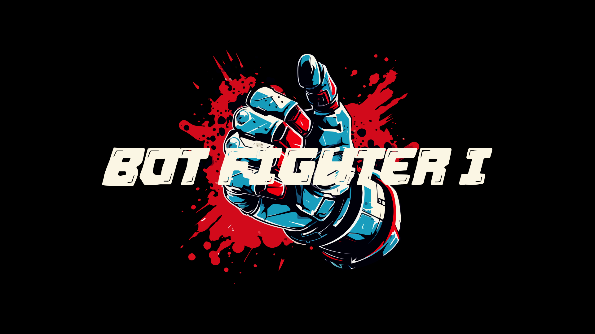

</img>

# BOT FIGHTER I

A text-based Street Fighter-esque Twitch bot, created in Python using TwitchIO. 


## Demo
<video controls autoplay><source src="./assets/botfighter_demo.mp4"></video>

## Installation

To deploy this project, install the pipenv enviornment and run.

```bash
  pip install pipenv
  pipenv --python 3.11 [or most recent]
```

Then, install the TwitchIO library.
```bash
pipenv install twitchio
```
## Deployment

Finally, run the program.

```bash
pipenv run python bot.py
```
## Usage/Examples

```bash
!fight @insert_name

!surrender

!leaderboard
```

## Features

- Scoreboard for fighters.
- Rage-quitting.
